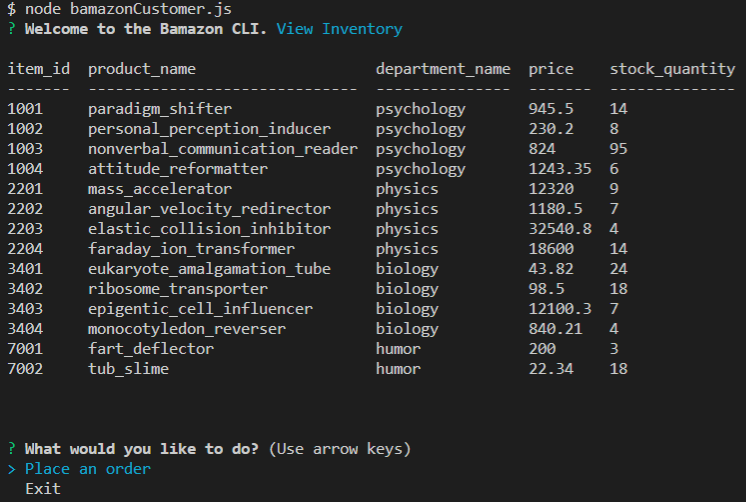
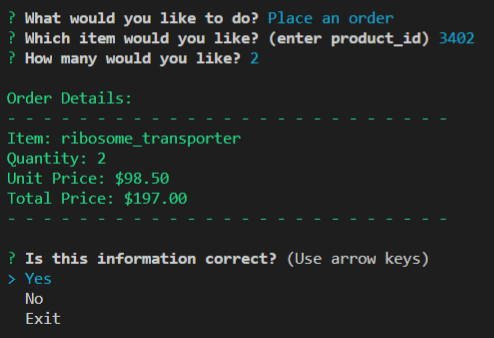
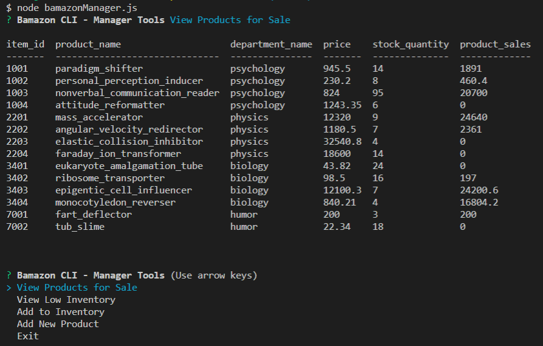
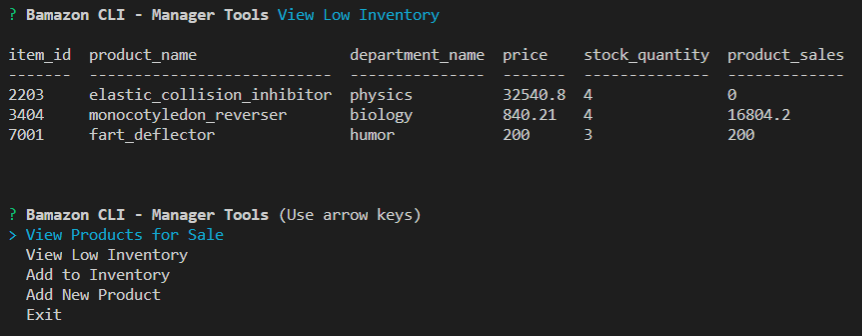
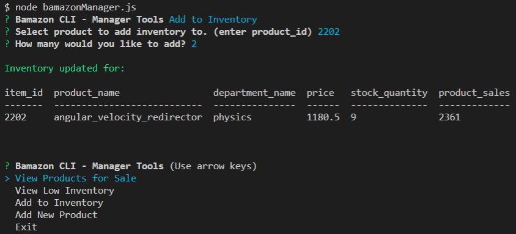
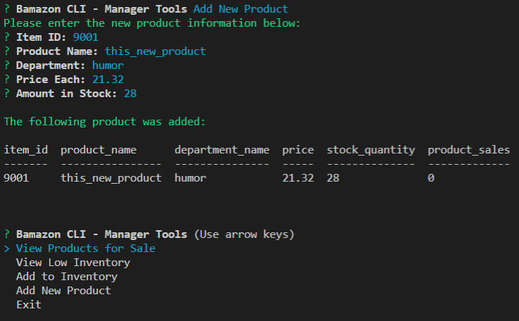
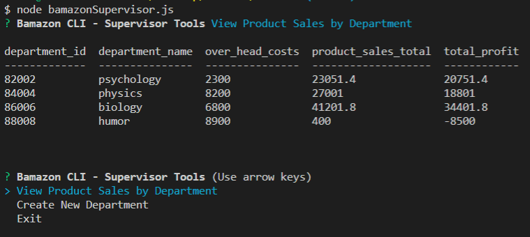
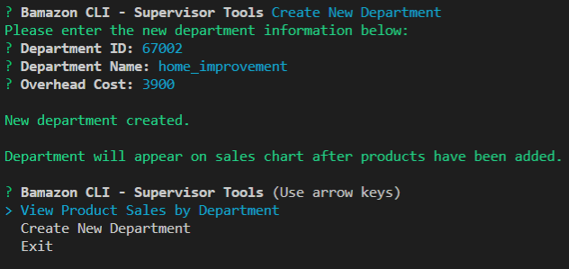

# Bamazon
Command line inventory system that offers customers inventory view, and purchase options.
Provides manager options for viewing and adding products and inventory.
The program also has a supervisor function that allows them to view sales by department and to add new departments. 

## Customer View
Offers the ability to view inventory and place an order

Confirms order information.

## Manager View 
Offers ability to view all inventory or just low inventory.

Allows for updating current inventory and for adding new products.

## Supervisor View
Offers ability to see profitability by department.

Allows for adding new departments. 
